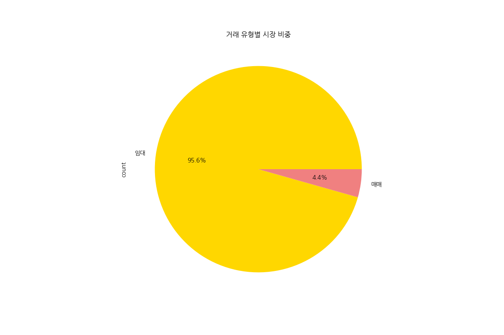
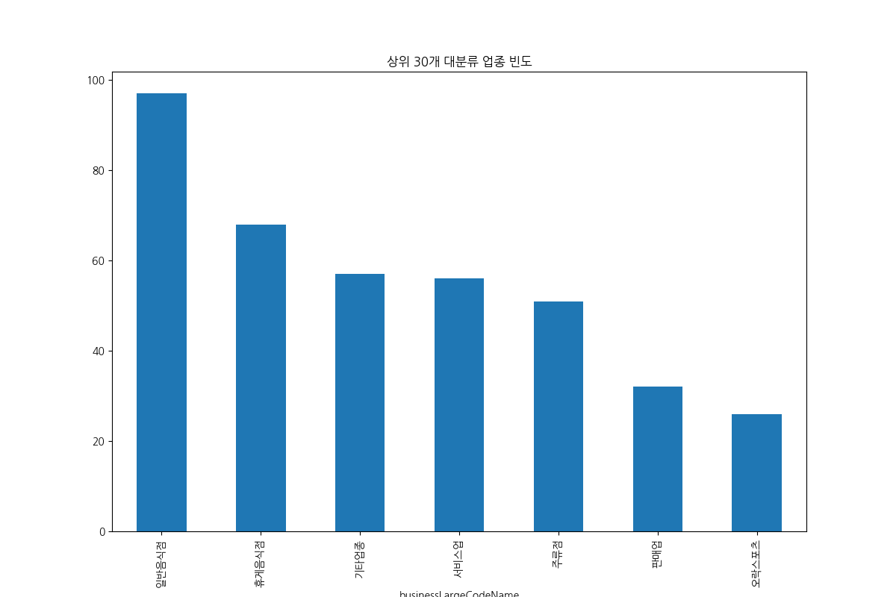
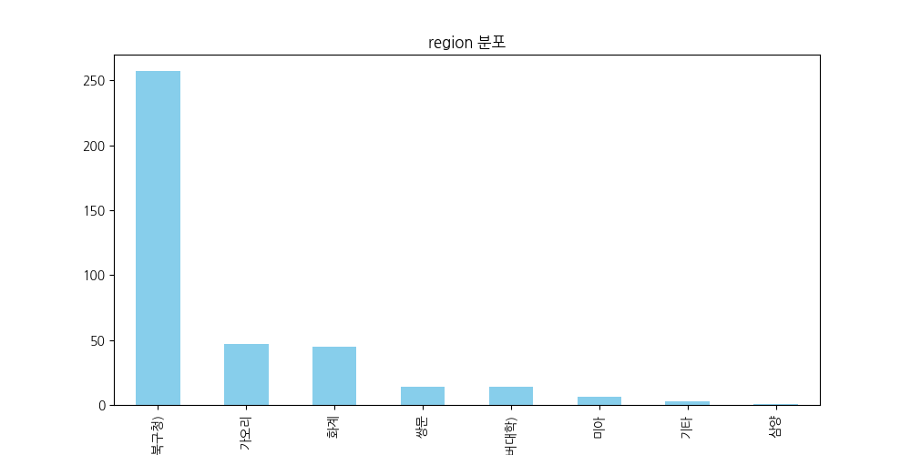
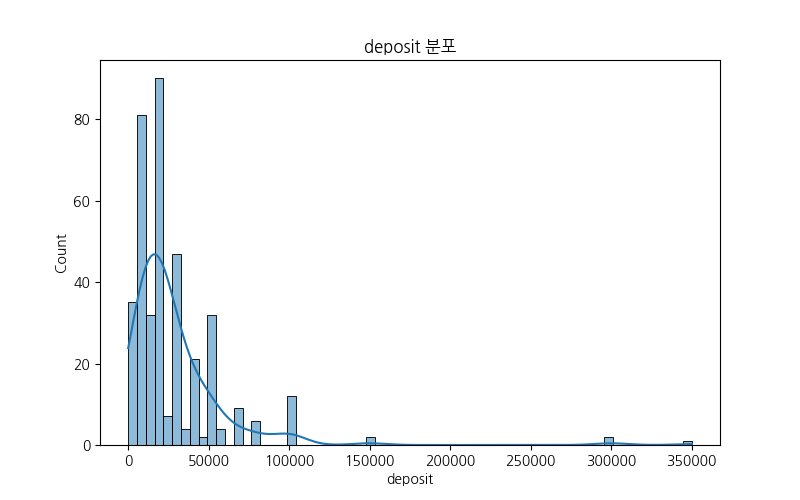
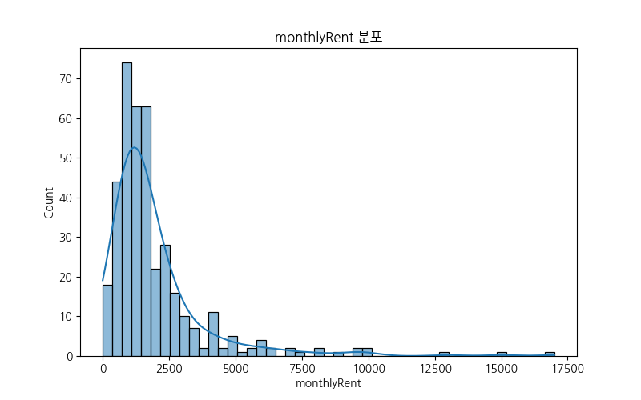
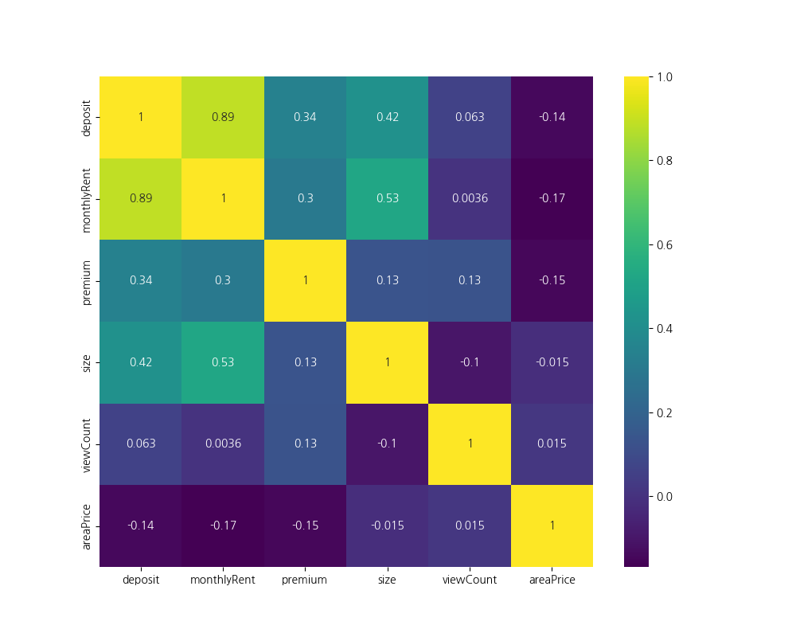
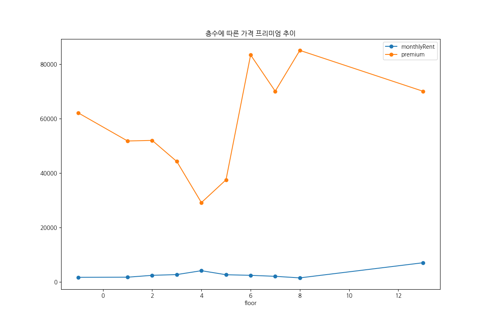
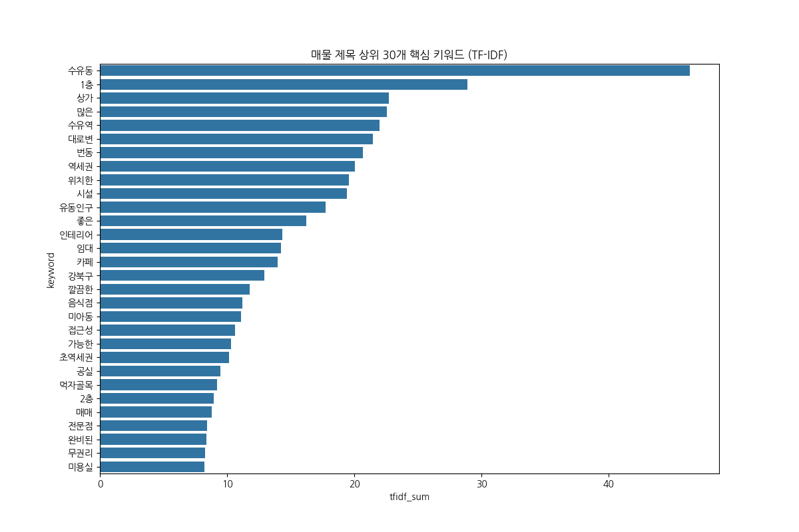

# 종합 상가 데이터 대시보드
## 분석 결과 보고서

<!-- note: 안녕하세요. 우아하고 고풍스러운 Art Deco Luxe 스타일로 분석 결과를 보고하겠습니다. 이번 발표에서는 최근 수집된 상가 데이터를 바탕으로 핵심 지표를 분석하고, 향후 전략 수립을 위한 인사이트를 도출하고자 합니다. 데이터를 품격 있게 다룰 예정이니 끝까지 함께해 주시기 바랍니다. -->

---

# 1. 핵심 성과 지표 (KPI)

| 지표 | 값 |
| :--- | :--- |
| **전체 매물** | 387건 |
| **평균 보증금** | 2,889만 |
| **평균 월세** | 194만 |
| **평균 면적** | 95.4㎡ |
| **최다 업종** | 일반음식점 |

<!-- note: 첫 번째, 핵심 성과 지표입니다. 총 387건의 매물을 정교하게 분석했습니다. 일반음식점이 가장 두드러진 업종으로 나타났습니다. 이 지표들은 시장의 가치를 나타내는 중요한 데이터이며, 앞으로 이어질 분석의 기반이 됩니다. -->

---

# 2. 업종 분석

## 업종 분포 및 지역별 분포

<!-- note: 두 번째, 업종 분석입니다. 지역과 업종 간의 깊은 연관성을 분석했습니다. 시장의 틈새를 찾아 전략적인 입지를 선정하는 것이 핵심입니다. 데이터 기반으로 세밀한 포지셔닝을 수행하여 수익을 극대화해야 합니다. -->

---

# 3. 상권 밀집도

## 보증금 및 월세 분포

<!-- note: 세 번째, 상권 밀집도입니다. 보증금 중앙값 2,000만원은 진입을 위한 중요한 기준선입니다. 월세 100~150만원 구간을 효율적으로 공략하여 안정적인 수익 구조를 창출해야 합니다. 전략적인 협상이 필요한 시점입니다. -->

---

# 4. 입지 및 트렌드

## 가격 상관관계 및 층별 트렌드

<!-- note: 네 번째, 입지 및 트렌드입니다. 보증금과 월세의 상관관계를 통해 협상력을 극대화할 수 있습니다. 고층부의 가치를 발견하는 지혜가 필요합니다. 시장의 흐름을 놓치지 않고 예측하는 통찰력을 제안합니다. -->

---

# 5. 핵심 키워드 TOP 10

<!-- note: 마지막으로 시장을 움직이는 핵심 키워드 10가지입니다. 1층, 대로변, 역세권은 시장의 가치를 보증하는 요소들입니다. 이 키워드들을 통해 상가의 진정한 가치를 고객들에게 우아하게 전달할 수 있습니다. -->

---

# 감사합니다.

<!-- note: 이상으로 보고를 마칩니다. 데이터를 통해 시장의 품격 있는 흐름을 읽는 시간이었습니다. 질문이 있으시면 언제든지 말씀해 주십시오. 감사합니다. -->
